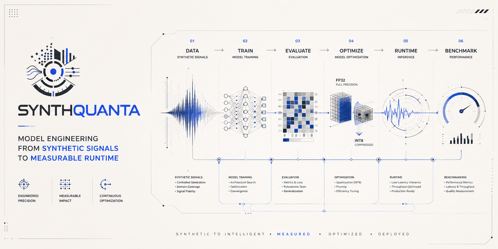
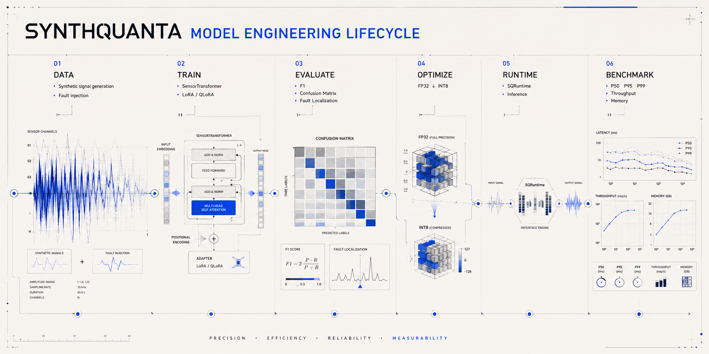
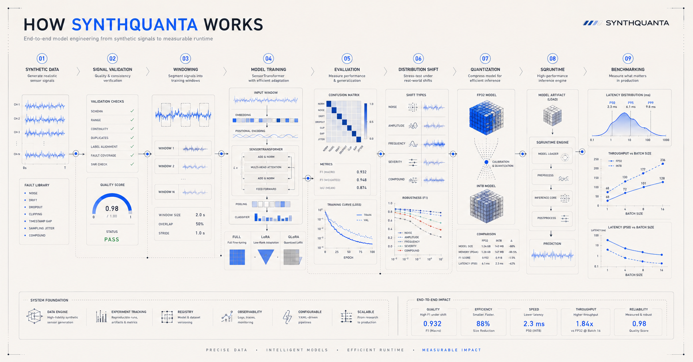
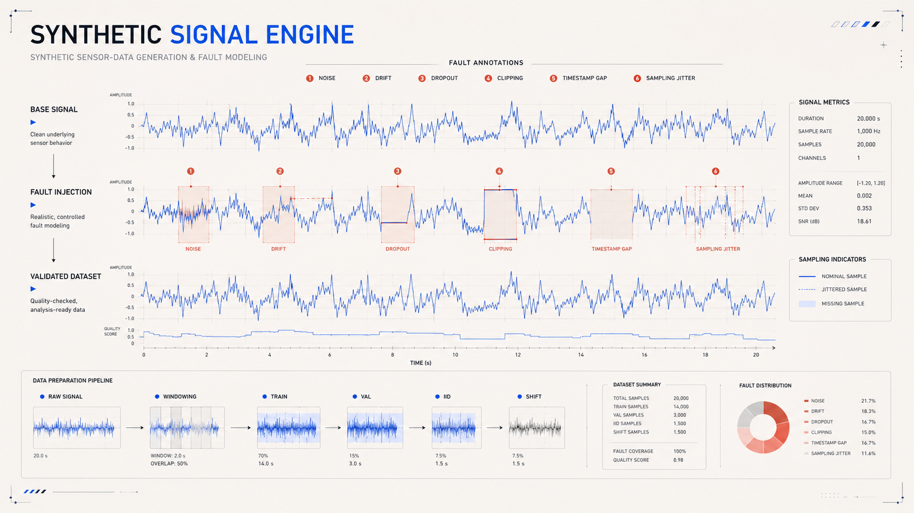
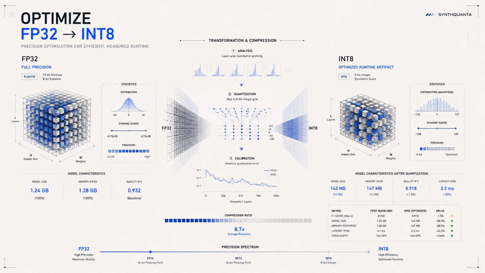
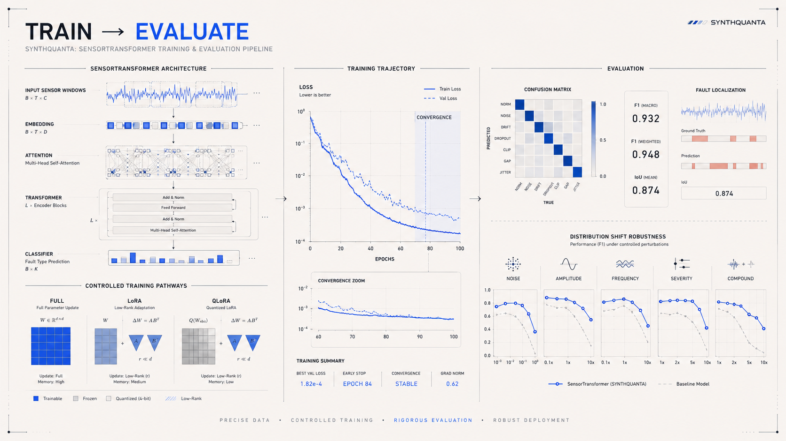
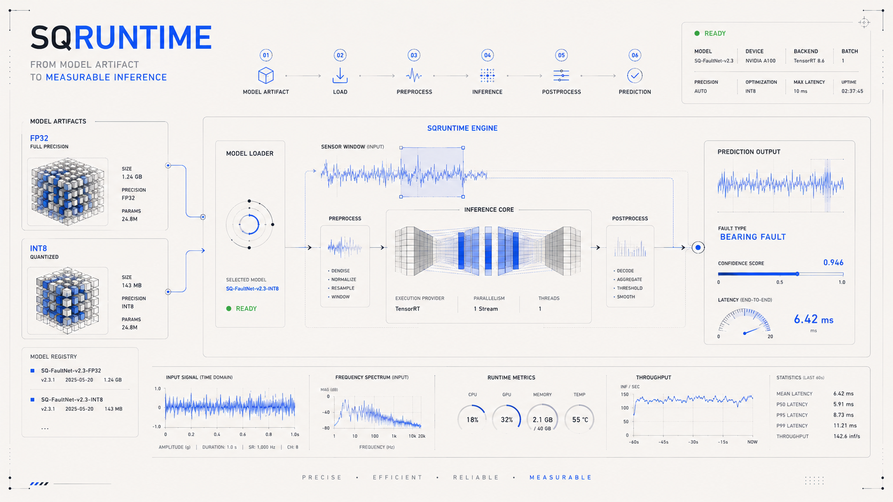
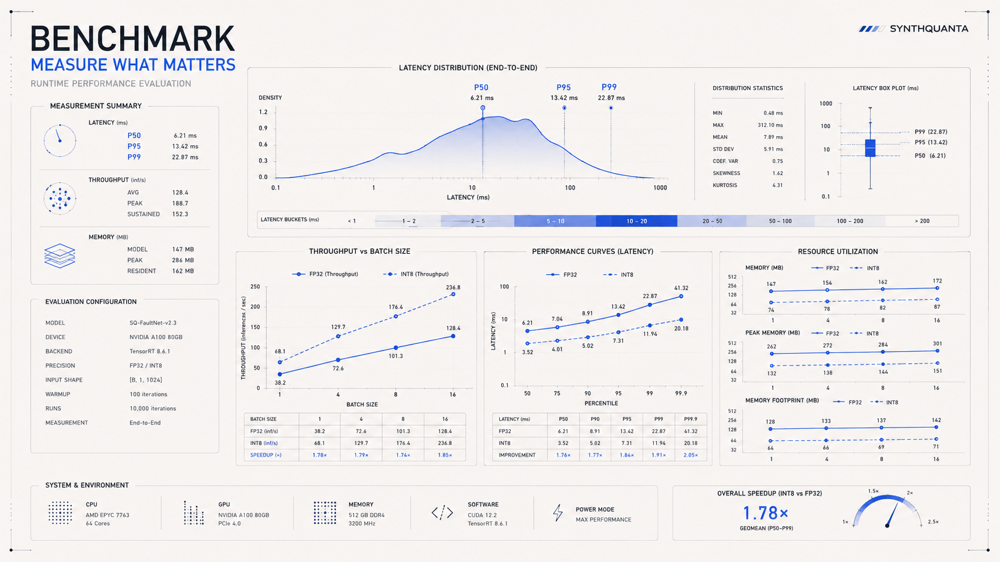
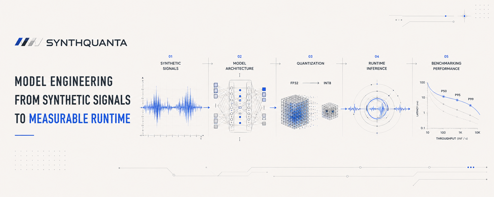

<p align="center">
  
</p>

<h1 align="center">SynthQuanta</h1>
<h3 align="center">Synthetic Data–Driven Fine-Tuning and Quantized Model Serving Runtime</h3>

<p align="center">
  <em>From synthetic data to measurable inference.</em>
</p>

<p align="center">
  
  
  
  
  
  
  
  
  
</p>

<br />

<p align="center">
  
</p>

<br />

SynthQuanta is a **local-first model engineering platform** that takes a task-specific model through the complete engineering lifecycle — from deterministic synthetic sensor data and controlled fault injection, through LoRA/QLoRA fine-tuning, distribution-shift evaluation, INT8 quantization, and custom runtime inference, to reproducible performance benchmarking.

The core application is a **Synthetic Sensor-Log Quality Inspector**: a 7-class time-series classifier that learns to distinguish normal sensor behavior from six forms of signal corruption, then gets evaluated for robustness, compressed, and served through a purpose-built inference runtime called **SQRuntime**.

---

## The Engineering Question

> *How effectively can synthetic sensor data be used to fine-tune a task-specific model for sensor-quality inspection, and how do fine-tuning, distribution shift, quantization, and runtime optimization affect both predictive quality and inference efficiency?*

Most ML portfolio projects stop here:

```
Dataset → Train → Accuracy
```

That is insufficient for real model engineering. SynthQuanta treats deployment as a **multi-objective engineering problem** — measuring two dimensions simultaneously:

| Dimension | Question |
|---|---|
| **Model Quality** | Does the model correctly classify sensor faults — including under distribution shift? |
| **System Performance** | How fast, how memory-efficient, and how throughput-capable is the model in a real serving runtime? |

---

## The Complete Lifecycle

<p align="center">
  
</p>

<p align="center"><em>The complete model engineering lifecycle — from controlled synthetic data to benchmarked inference.</em></p>

```
Synthetic Data Generation
        ↓
Controlled Fault Injection
        ↓
Dataset Validation
        ↓
LoRA / QLoRA Fine-Tuning
        ↓
Quality Evaluation
        ↓
Distribution-Shift Evaluation
        ↓
INT8 Quantization
        ↓
SQRuntime Inference
        ↓
Latency / Throughput / Memory Benchmarking
```

---

## How SynthQuanta Works

<p align="center">
  
</p>

<p align="center"><em>Nine engineering stages from a blank configuration to a benchmarked inference runtime.</em></p>

| Stage | What Happens |
|---|---|
| **1. Generate** | A deterministic signal generator produces clean sinusoidal, multi-frequency, or composite sensor streams from a configuration file and a random seed. Same seed → same data. |
| **2. Corrupt** | Six fault injectors apply controlled degradations: noise, drift, dropout, clipping, timestamp gaps, and sampling jitter. Each fault is parameterized, severity-configurable, and composite. |
| **3. Validate** | The dataset validator checks structural integrity, temporal consistency, statistical properties, and ground-truth label coherence before any training occurs. |
| **4. Train** | The SensorTransformer — a compact 7-class time-series classifier — is fine-tuned with full fine-tuning, LoRA, or QLoRA. Every experiment records architecture, hyperparameters, adapter config, seed, and metrics. |
| **5. Evaluate** | Classification metrics (Precision, Recall, F1, Confusion Matrix, False Alarm Rate) and fault-localization metrics (Interval IoU) are computed on a held-out test split. |
| **6. Shift** | Five distribution-shift scenarios stress-test the model on data it has never seen. The system reports IID F1, shifted F1, absolute degradation, and relative degradation per scenario. |
| **7. Quantize** | The FP32 model artifact is compressed to INT8 via PyTorch dynamic quantization. Both artifacts are persisted separately. Size, memory, and latency tradeoffs are measured from actual execution. |
| **8. Run** | SQRuntime loads the selected model (FP32 or INT8), performs a validation forward pass, and enters the `ready` state. Single and batch inference are exposed through the API. |
| **9. Benchmark** | The BenchmarkEngine runs controlled latency measurements across batch sizes, excluding warmup iterations from statistics and capturing P50, P90, P95, P99, throughput, and memory. |

---

## What Makes SynthQuanta Different

```
┌─────────────────────────────────┐    ┌─────────────────────────────────────┐
│  Typical ML Portfolio Project   │    │  SynthQuanta                        │
├─────────────────────────────────┤    ├─────────────────────────────────────┤
│                                 │    │                                     │
│  Download Dataset               │    │  Generate Deterministic Data        │
│          ↓                      │    │          ↓                          │
│  Train Model                    │    │  Inject Controlled Faults           │
│          ↓                      │    │          ↓                          │
│  Report Accuracy                │    │  Validate Dataset                   │
│                                 │    │          ↓                          │
│  Done.                          │    │  Fine-Tune (LoRA / QLoRA)           │
│                                 │    │          ↓                          │
│                                 │    │  Evaluate Classification Quality    │
│                                 │    │          ↓                          │
│                                 │    │  Test Distribution Shift (5 scenarios) │
│                                 │    │          ↓                          │
│                                 │    │  Quantize FP32 → INT8               │
│                                 │    │          ↓                          │
│                                 │    │  Serve via SQRuntime                │
│                                 │    │          ↓                          │
│                                 │    │  Benchmark Latency, Throughput, Memory │
│                                 │    │          ↓                          │
│                                 │    │  Reproduce from Stored Config + Seed │
└─────────────────────────────────┘    └─────────────────────────────────────┘
```

The engineering disciplines demonstrated simultaneously:

```
CONTROL THE DATA    →  data engineering
TRAIN THE MODEL     →  model engineering
BREAK ASSUMPTIONS   →  robustness engineering
COMPRESS THE MODEL  →  model optimization
BUILD THE RUNTIME   →  inference systems
MEASURE INFERENCE   →  performance engineering
```

---

## Core Capabilities

### Data Engineering
- Deterministic synthetic sensor signal generation (sinusoidal, multi-frequency, composite, trend)
- Six configurable fault injectors with severity parameters and ground-truth interval recording
- Composite (multi-fault) corruption support
- Structural, temporal, statistical, and label-integrity dataset validation
- Fixed-length temporal windowing with 70/10/10/10 train/val/IID test/shift-test splits
- Dataset artifacts persisted as NPZ tensors with full metadata and lineage

### Model Engineering
- **SensorTransformer**: compact 7-class time-series transformer (normalization → embedding → 2-layer encoder → pooling → classification)
- Training methods: full fine-tuning, LoRA, QLoRA — all configurable and recorded per experiment
- Complete experiment tracking: architecture, hyperparameters, adapter config, seed, duration, checkpoint path, metrics
- Checkpointing and experiment ID lineage (`EXP-XXXX`)

### Evaluation
- Per-class and aggregate Precision, Recall, F1 (7 classes: NORMAL + 6 fault types)
- Confusion matrix
- False alarm rate
- Fault-localization Interval IoU (mean, median, IoU@0.5)

### Robustness Engineering
Five distribution-shift scenarios applied to a frozen, already-trained model:

| Scenario | Training Distribution | Test Distribution |
|---|---|---|
| Noise shift | σ = 0.10 | σ = 0.30 |
| Amplitude shift | amplitude = 1.0 | amplitude = 1.5 |
| Frequency shift | 10 Hz | 15 Hz |
| Severity shift | mild / moderate faults | severe faults |
| Compound shift | isolated faults | multiple simultaneous faults |

Each scenario produces: IID F1, shifted F1, absolute degradation, relative degradation, robustness ratio.

### Model Optimization
- FP32 baseline artifact (immutable after creation)
- INT8 artifact via PyTorch dynamic quantization (separate artifact)
- Post-quantization validation: load → inference → F1 comparison
- Actual size, memory, and latency measurements

### Inference Systems (SQRuntime)
- `UNINITIALIZED → LOADING → READY → FAILED` state machine
- Preprocessing: timestamps + values → normalized model tensor (matches training preprocessing)
- Single inference and batch inference
- Postprocessing: logits → structured result (quality, fault_type, confidence, fault_interval)
- Runtime telemetry: request count, error count, latency, throughput, memory, queue depth

### Performance Engineering
- Warmup iterations explicitly excluded from statistics
- P50, P90, P95, P99, min, max, mean latency per batch size
- Throughput (req/s) and peak memory (MB) per configuration
- Batch sizes tested: 1, 4, 8, 16
- Every benchmark record includes hardware, software, Python version, timestamp, and seed

---

## 01 — Synthetic Data & Fault Injection

<p align="center">
  
</p>

<p align="center"><em>Deterministic signal generation and controlled fault injection with full ground-truth labeling.</em></p>

The data engine starts from a deterministic clean signal configured by a YAML file and a random seed. The same configuration and seed always produce identical output.

**Six implemented fault families:**

| Fault | What it simulates |
|---|---|
| `NOISE` | Additive Gaussian noise — stochastic sensor degradation |
| `DRIFT` | Linear or polynomial signal drift — gradual sensor degradation |
| `DROPOUT` | Missing observations — sensor connectivity loss |
| `CLIPPING` | Saturation above/below sensor range — ADC overflow |
| `TIMESTAMP_GAP` | Temporal discontinuities — logging gaps |
| `SAMPLING_JITTER` | Irregular sample intervals — clock instability |

Faults can be composed — a signal can carry noise, drift, and a timestamp gap simultaneously. The ground truth records every fault's type, start index, end index, severity, and parameters.

The validator runs before any training begins: structural checks (shape, dtype, NaN), temporal checks (monotonic timestamps, gap detection), statistical checks (signal distribution), and label-integrity checks (all classes represented).

---

## 02 — Training & Evaluation

<p align="center">
  
</p>

<p align="center"><em>SensorTransformer fine-tuning and multi-metric evaluation under IID and distribution-shifted conditions.</em></p>

### SensorTransformer

A compact time-series transformer designed for CPU-scale local training:

```
Input (batch, window_size, 1)
    ↓  Linear projection → embedding_dim (32)
Temporal Embedding (linear + learned positional)
    ↓
LayerNorm
    ↓
2 × TransformerBlock (explicit Q/K/V projections — LoRA targets)
    ↓
Global average pooling
    ↓
Classification head → 7 classes
    ↓
ModelOutput (logits, probabilities, fault_class, confidence)
```

The architecture is deliberately small — this project demonstrates model engineering, not GPU-scale training.

### Training Methods

| Method | Description |
|---|---|
| **Full fine-tuning** | All parameters updated |
| **LoRA** | Low-rank adapter injected into Q/K/V projections; base model frozen |
| **QLoRA** | LoRA with quantization-aware adapter loading |

Training records: dataset ID, architecture config, method, LoRA rank/alpha/dropout, trainable parameter count, seed, duration, checkpoint path, hardware, and software versions.

> **Failure contract:** If QLoRA cannot run given the hardware configuration, the system detects, reports, and fails explicitly. It never silently falls back to full fine-tuning.

### Evaluation Metrics

- Precision, Recall, F1 — per class (7 classes) and aggregate (macro)
- Confusion matrix
- False alarm rate (false positives on NORMAL class)
- Fault localization: Interval IoU (mean, median, IoU@0.5)

---

## Distribution Shift

SynthQuanta does not only ask: *"Does the model perform well on IID data?"*

It also asks: *"Does the model remain useful when the deployment distribution differs from training?"*

The five shift scenarios are applied to a **frozen model** — no retraining, no weight updates. A new dataset is generated with shifted parameters, and the same model is evaluated. The difference in F1 between IID and shifted conditions is the primary robustness signal.

This tests whether synthetic-data training creates a model that overfits to one specific noise regime, amplitude range, or frequency, or whether it generalizes to nearby distributions.

---

## 03 — Model Optimization

<p align="center">
  
</p>

<p align="center"><em>FP32 → INT8 optimization path with artifact isolation and measured quality/efficiency tradeoffs.</em></p>

### Quantization Contract

```
FP32 Artifact (immutable)
        ↓
PyTorch Dynamic INT8 Quantization
        ↓
INT8 Artifact (separate, validated)
        ↓
Comparison (F1 delta, size reduction, latency ratio, memory ratio)
```

**Rules enforced in code:**
- FP32 artifact is never modified after creation
- INT8 is always a separate artifact file
- After quantization, the quantized model is loaded and run on the test dataset — F1 is measured from actual inference
- If quantization fails, the job is marked `FAILED` with a diagnostic — no silent fallback to FP32

> **Note on benchmark results:** Model training artifacts have not yet been generated in this repository (training requires a configured database and artifact path). Run the full lifecycle via the UI or API to produce actual F1 delta and latency comparison numbers.

---

## 04 — SQRuntime

<p align="center">
  
</p>

<p align="center"><em>SQRuntime — a purpose-built inference runtime with state management, preprocessing, and live telemetry.</em></p>

SQRuntime is the inference layer between the FastAPI API and the model artifact. **Inference logic never lives in the API route.** The runtime is independently testable without HTTP.

### Architecture

```
API Route
    ↓
RuntimeService (singleton)
    ↓
SQRuntime
    ├── ModelLoader    — load_model(), warmup(), unload()
    ├── Preprocessor   — timestamps + values → normalized tensor
    ├── InferenceEngine — predict(window), predict_batch(windows)
    ├── Postprocessor  — logits → {quality, fault_type, confidence, fault_interval}
    └── Telemetry      — request_count, error_count, latency, throughput, memory
```

### State Machine

```
UNINITIALIZED → LOADING → READY
                        ↘ FAILED
```

The runtime reports `READY` only after a successful validation forward pass. A failed warmup transitions to `FAILED` with a diagnostic — never silently to `READY`.

### Telemetry

The telemetry endpoint exposes live runtime metrics: request count, error count, average and P95 latency, current throughput, and memory utilization — all derived from actual execution, not estimates.

---

## 05 — Benchmarking

<p align="center">
  
</p>

<p align="center"><em>Controlled latency, throughput, and memory measurement across batch sizes. All numbers from actual execution.</em></p>

The BenchmarkEngine drives **SQRuntime** — not raw model internals — ensuring that benchmark results reflect real serving latency, not just forward-pass timing.

### What is Measured

| Metric | Description |
|---|---|
| P50 | Median latency across measured requests |
| P90 | 90th-percentile latency |
| P95 | 95th-percentile latency (primary UI metric) |
| P99 | 99th-percentile latency |
| Throughput | Requests per second |
| Peak Memory | Tracemalloc-measured peak allocation (MB) |

### Benchmark Configuration

- **Batch sizes:** 1, 4, 8, 16
- **Warmup:** configurable number of iterations excluded from all statistics
- **Iterations:** configurable per batch size
- **Record contents:** model ID, precision (FP32/INT8), device, batch size, iterations, warmup count, runtime version, Python version, hardware info, timestamp, seed

> **Benchmark results are generated from actual runtime executions.** Run the benchmark workflow after training and loading a model to populate this section with measured values.

---

## Model Engineering Results

> Artifact-backed results are produced by running the full lifecycle from the UI or API. The artifact directories for models, evaluations, and benchmarks are currently empty — all metrics will populate on first end-to-end run.

The system is designed to expose results in the following structure once experiments complete:

**Classification Quality (IID)**
- Precision, Recall, F1 per class (7 classes)
- Macro F1 aggregate
- Confusion matrix
- False alarm rate

**Robustness (Distribution Shift)**
- IID F1 vs. shifted F1 per scenario
- Absolute and relative degradation

**Optimization**
- FP32 vs. INT8 F1 delta
- Model size reduction (MB)
- Latency ratio (FP32 → INT8)
- Memory ratio

**Runtime Performance**
- P50 / P95 / P99 latency by batch size
- Peak throughput (req/s)
- Peak memory (MB)

---

## Architecture

<br />

```
┌────────────────────────────────────────────┐
│            Next.js Frontend                │
│  (Workflow UI — 7 stages, light theme)     │
└─────────────────┬──────────────────────────┘
                  │  REST / JSON  /api/v1
┌─────────────────▼──────────────────────────┐
│              FastAPI Backend               │
│                                            │
│  ┌─────────────────────────────────────┐   │
│  │              Services               │   │
│  │  dataset · training · evaluation    │   │
│  │  quantization · runtime · benchmark │   │
│  └──────┬──────────┬──────────┬────────┘   │
│         │          │          │            │
│  ┌──────▼──┐  ┌────▼───┐  ┌──▼────────┐  │
│  │  Data   │  │   ML   │  │ SQRuntime │  │
│  │ Engine  │  │Pipeline│  │ + Bench   │  │
│  └──────┬──┘  └────┬───┘  └──▼────────┘  │
│         └──────────┴──────────┘            │
│                    │                       │
│  ┌─────────────────▼──────────────────┐   │
│  │  PostgreSQL (metadata)             │   │
│  │  Filesystem (artifacts — NPZ, PT)  │   │
│  └────────────────────────────────────┘   │
└────────────────────────────────────────────┘
```

**Layering rule enforced throughout:** API Routes → Service Layer → Domain Modules → Infrastructure. Inference logic never appears in a route handler.

---

## Experiment Lineage

Every entity in SynthQuanta carries a lineage chain:

```
Dataset (DS-XXXX)
    ↓  used by
Experiment (EXP-XXXX)
    ↓  produces
Model Checkpoint (MODEL-XXXX/base + adapter)
    ↓  evaluated by
Evaluation Result (with IID + shift metrics)
    ↓  compressed to
Quantized Model (INT8 artifact)
    ↓  loaded into
SQRuntime
    ↓  benchmarked by
Benchmark Record (BENCH-XXXX)
```

This chain means that for any benchmark number, you can trace back to the exact dataset configuration, training method, LoRA rank, and random seed that produced it.

---

## Repository Structure

```
SynthQuanta/
├── backend/
│   ├── app/
│   │   ├── api/v1/routes/          ← health, datasets, training, evaluation,
│   │   │                               quantization, runtime, benchmark
│   │   ├── data/                   ← engine, signals, faults (6 types),
│   │   │                               validation, windowing
│   │   ├── ml/
│   │   │   ├── adapters/           ← lora.py, qlora.py
│   │   │   ├── datasets/           ← SensorWindowDataset
│   │   │   ├── evaluation/         ← metrics, localization, distribution_shift
│   │   │   ├── models/             ← sensor_transformer.py
│   │   │   ├── quantization/       ← engine.py, backend_detect.py
│   │   │   └── training/           ← trainer
│   │   ├── runtime/                ← runtime.py, health, preprocessing,
│   │   │                               postprocessing, telemetry
│   │   ├── benchmarking/           ← engine.py, latency.py, memory.py
│   │   ├── services/               ← dataset, training, evaluation,
│   │   │                               quantization, runtime, benchmark
│   │   ├── db/                     ← SQLAlchemy models, repositories, session
│   │   └── schemas/                ← Pydantic models for all API entities
│   └── tests/
│       ├── unit/                   ← data, ml, benchmark, runtime
│       ├── integration/            ← datasets, training, evaluation,
│       │                               quantization, runtime, benchmark
│       └── e2e/                    ← full lifecycle + final E2E suite
├── frontend/
│   ├── app/
│   │   ├── page.tsx                ← app shell, stage routing, workflow state
│   │   └── globals.css             ← sq-* design system
│   ├── components/                 ← WorkflowNav, Overview, DataStudio,
│   │                                   TrainLab, EvalLab, QuantizeLab,
│   │                                   RuntimeConsole, BenchmarkLab
│   └── lib/api.ts                  ← typed API client
├── configs/
│   ├── data/                       ← dataset generation YAML configs
│   ├── training/                   ← training YAML configs
│   ├── evaluation/                 ← evaluation YAML configs
│   ├── quantization/               ← quantization YAML configs
│   └── benchmarks/                 ← benchmark YAML configs
├── artifacts/
│   ├── datasets/                   ← DS-XXXX/ (NPZ + metadata.json)
│   ├── models/                     ← MODEL-XXXX/ (base + adapter + metadata)
│   ├── evaluations/
│   ├── experiments/
│   ├── quantizations/
│   └── benchmarks/
├── media/                          ← README visual assets
├── scripts/                        ← utility scripts
├── docker-compose.yml
├── .env.example
└── CLAUDE.md                       ← engineering contract
```

---

## Technology Stack

| Layer | Technologies |
|---|---|
| **Frontend** | Next.js 16.3.0, React 19, TypeScript 5.7, Tailwind CSS v4, shadcn/ui |
| **Backend** | FastAPI 0.115+, Uvicorn, Pydantic v2, Python 3.11+ |
| **ML** | PyTorch 2.2+, PEFT (LoRA/QLoRA), Transformers, NumPy, SciPy, scikit-learn |
| **Persistence** | PostgreSQL 16, SQLAlchemy 2.0, Alembic (migrations) |
| **Testing** | pytest, pytest-asyncio, httpx (test client) |
| **Infrastructure** | Docker, Docker Compose |

---

## Reproducibility

Every experiment in SynthQuanta is designed to be exactly reproducible from its stored configuration. A benchmark number without provenance is not trustworthy — SynthQuanta enforces provenance.

**What is recorded with every dataset:**
- Random seed
- Generator version
- Full configuration (signal type, duration, sampling rate, all fault parameters)

**What is recorded with every experiment:**
- Dataset ID (links to exact data)
- Model architecture (all hyperparameters)
- Training method (full / LoRA / QLoRA)
- LoRA configuration (rank, alpha, dropout, trainable parameter count)
- Seed, duration, checkpoint path
- Hardware (CPU/GPU/RAM) and software versions (Python, PyTorch, PEFT)

**What is recorded with every benchmark:**
- Model ID and precision (FP32/INT8)
- Device, batch size, iterations, warmup count
- Runtime version, Python version, hardware, timestamp, seed
- Raw per-request latencies (derived statistics computed from these)

**Reproducibility test (in the unit suite):**
```python
generate(config, seed=42) == generate(config, seed=42)  # within numerical tolerance
```

---

## Quick Start

### Docker (recommended)

```bash
cp .env.example .env
docker compose up --build
```

| Service | URL |
|---|---|
| Frontend | http://localhost:3000 |
| Backend API | http://localhost:8000 |
| API Docs | http://localhost:8000/docs |

### Manual Development

**Backend:**

```bash
cd backend
pip install -e ".[dev,ml]"
cp ../.env.example ../.env   # edit DATABASE_URL
alembic upgrade head
uvicorn app.main:app --reload --port 8000
```

**Frontend:**

```bash
cd frontend
npm install
npm run dev
```

---

## Configuration

Copy `.env.example` to `.env` and set:

| Variable | Default | Description |
|---|---|---|
| `APP_ENV` | `development` | Runtime environment |
| `DATABASE_URL` | `postgresql://...` | PostgreSQL connection string |
| `ARTIFACT_ROOT` | `../artifacts` | Filesystem path for generated artifacts |
| `CORS_ORIGINS` | `["http://localhost:3000"]` | Allowed frontend origins (JSON array) |
| `LOG_LEVEL` | `INFO` | Application log level |

Never commit `.env` — it is `.gitignore`d.

---

## End-to-End Workflow

The complete lifecycle from the SynthQuanta UI (or API):

```
1. Open Signal Studio → configure seed, duration, fault mix → Generate Dataset
2. Inspect the dataset's waveform and fault overlay in the signal panel
3. Open Adapter Lab → select LoRA / QLoRA / full → set hyperparameters → Start Training
4. Wait for training to complete → inspect F1, confusion matrix, Interval IoU
5. Open Robustness Lab → Run Evaluation → view 5 shift scenarios and degradation
6. Open Quantize Lab → Quantize to INT8 → compare size / memory / F1 delta
7. Open Serve Console → Load Model into SQRuntime → submit inference windows
8. Open Benchmark Lab → run benchmark across batch sizes → read P95, throughput, memory
```

---

## API

All endpoints are documented interactively at `http://localhost:8000/docs`.

**Base path:** `/api/v1`

| Domain | Endpoints |
|---|---|
| **Health** | `GET /health` |
| **Datasets** | `POST /datasets/generate` · `GET /datasets` · `GET /datasets/{id}` |
| **Training** | `POST /training/run` · `GET /training/{experiment_id}` |
| **Evaluation** | `POST /evaluation/run` · `GET /evaluation/{id}` · `GET /evaluation` |
| **Quantization** | `POST /quantization/run` · `GET /quantization/{id}` · `GET /quantization` |
| **Runtime** | `POST /runtime/load` · `GET /runtime/health` · `POST /runtime/predict` · `POST /runtime/predict/batch` · `GET /runtime/telemetry` |
| **Benchmarks** | `POST /benchmarks/run` · `GET /benchmarks/{id}` · `GET /benchmarks` |

Long-running jobs (training, evaluation, quantization, benchmarking) return a `job_id` immediately. Poll the corresponding GET endpoint until the status reaches `COMPLETED` or `FAILED`.

**Error format:**

```json
{
  "error": {
    "code": "MODEL_NOT_READY",
    "message": "SQRuntime is in state 'uninitialized'. Call /runtime/load first."
  }
}
```

---

## Testing

```bash
cd backend
pytest
```

**Test suite structure:**

| Layer | Count | Coverage |
|---|---|---|
| Unit | 360 tests | Signal generation, fault injection (all 6 types), validation, windowing, transformer model, LoRA/QLoRA adapters, training, evaluation metrics, distribution shift, localization, quantization, SQRuntime (preprocessing, inference, postprocessing, telemetry), benchmark latency/memory |
| Integration | Included in 360 | Dataset → artifact, training → checkpoint, SQRuntime → inference result, API route → service |
| E2E | 44 tests | Full lifecycle: generate → train → evaluate → quantize → SQRuntime → benchmark |
| **Total** | **404 tests** | |

The E2E suite runs on a minimal configuration (small model, tiny dataset, 1–2 epochs) to complete in CI within a reasonable time window.

**Key reproducibility test:**
```bash
pytest tests/unit/data/test_engine.py -k "reproducibility"
```

---

## Security

Input validation enforced at all system boundaries:

- **Shape validation:** tensor shapes are checked before model input; malformed windows are rejected with a structured error
- **Range validation:** NaN and Inf values are checked and rejected with diagnostics
- **Path restriction:** artifact paths are validated against the configured `ARTIFACT_ROOT`; no path traversal possible via API parameters
- **Type validation:** all API payloads go through Pydantic schemas; raw dicts never returned from routes
- **Log sanitization:** no raw user data or secrets appear in application logs
- **Secret handling:** all secrets via environment variables; never in source code

---

## Frontend

<br />

The SynthQuanta UI is organized around the model-engineering workflow itself. Navigation follows the natural progression of the lifecycle:

```
00 OVERVIEW → 01 DATA → 02 TRAIN → 03 EVALUATE → 04 OPTIMIZE → 05 RUNTIME → 06 BENCHMARK
```

**Visual philosophy:** light editorial theme (`#F4F3EF` background, `#1C44BE` accent), bottom workflow navigation bar, pure SVG data visualizations (no charting library dependency), workspace-scoped panels with real-time polling for long-running jobs.

**Workspace components:**
| Stage | Component | Key Visualizations |
|---|---|---|
| Overview | `Overview.tsx` | Pipeline topology SVG, lifecycle progress bar |
| Signal Studio | `DataStudio.tsx` | Live waveform preview SVG, fault toggle controls |
| Adapter Lab | `TrainLab.tsx` | Architecture diagram SVG, real-time loss chart SVG |
| Robustness Lab | `EvalLab.tsx` | 7×7 confusion matrix SVG, IID vs. shifted F1 dot plot |
| Quantize Lab | `QuantizeLab.tsx` | FP32→INT8 path diagram SVG, compression bar visualization |
| Serve Console | `RuntimeConsole.tsx` | State indicator, probability bars, live telemetry |
| Benchmark Lab | `BenchmarkLab.tsx` | Latency chart SVG (P50/P95 lines), throughput bars |

---

## Limitations

**Current MVP limitations:**
- Local-first only — no authentication, multi-user, or cloud deployment
- One active model in SQRuntime at a time (no concurrent model switching)
- Training is CPU-based; large models or long training runs will be slow
- `torch.ao.quantization.quantize_dynamic` (used for INT8) generates a DeprecationWarning in PyTorch 2.x — functionality is unaffected, migration to `torchao` is a post-MVP item
- PostgreSQL is required even for local development; a SQLite fallback is not provided
- No FP16 intermediate quantization step (MVP is FP32 → INT8 only, per design)
- Windows: `resource` module unavailable; memory measurement uses `tracemalloc` instead

**Explicitly out of scope for MVP:**
- Active learning / adaptive fault generation
- Model calibration / uncertainty estimation
- Dynamic batching / multi-model caching / hot-swapping
- Benchmark history / experiment leaderboard / Pareto model selection
- Kubernetes, distributed training, multi-GPU serving
- FP16 as an intermediate quantization step

---

## Roadmap

Post-MVP work identified in the architecture specification:

- **FP16 quantization** — add FP32 → FP16 → INT8 path as an explicit intermediate step
- **ONNX Runtime export** — produce ONNX artifacts for cross-runtime benchmarking
- **Model promotion gates** — configurable minimum F1 / IoU / shift-degradation thresholds before a model can be promoted to serving
- **Benchmark leaderboard** — compare benchmark records across model versions and quantization configs
- **Adaptive fault generation** — dynamically adjust fault difficulty based on model confidence during training
- **Multi-model serving** — maintain a pool of loaded models with hot-swapping capability
- **Authentication** — user sessions, RBAC for shared deployments

---

## Contributing

1. Fork the repository
2. Create a feature branch
3. Implement against the engineering contract in `CLAUDE.md`
4. Ensure `pytest` passes (404 tests)
5. Open a pull request

All changes must comply with the non-negotiable rules in `CLAUDE.md §23`. In particular: never fabricate ML metrics, never hide failures, and never break reproducibility.

---

<p align="center">
  
</p>

<br />

<p align="center">
  SynthQuanta is not just a model that predicts sensor failures.<br />
  It is an end-to-end demonstration of what happens when a model moves from<br />
  controlled synthetic data to an optimized, benchmarked, production-style inference runtime.
</p>

<br />

<p align="center">
  <em>Data engineering · Model engineering · Robustness engineering · Model optimization · Inference systems · Performance engineering</em>
</p>
